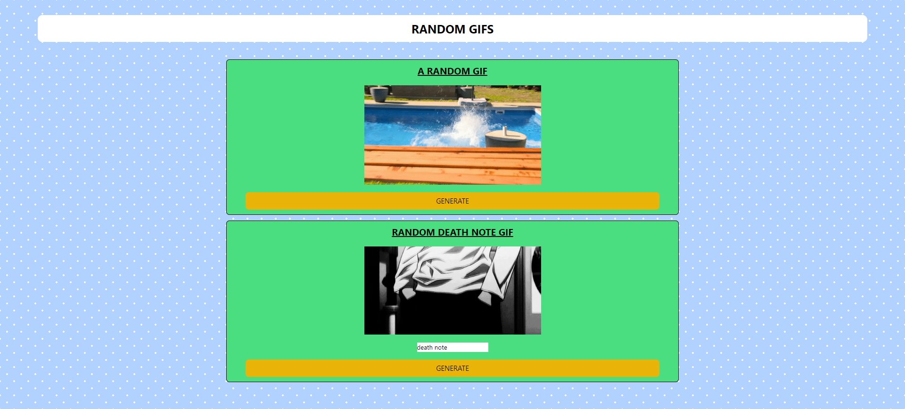

# Random Gifs Project

## Overview

The Random Gifs project is a simple web application that allows users to explore and generate random GIFs. The application consists of two GIF panels: one for generating random GIFs and another for displaying GIFs based on user-provided tags.

## Features

- **Random GIF Generator:** Click the button to generate a random GIF on the first panel.
- **Tag-based GIF Display:** Enter a tag in the input field on the second panel to get a GIF related to the provided tag.
- **Default Tag GIF:** The second panel also displays a default GIF related to a pre-defined tag upon page load.

## Technologies Used

- React JS
- Tailwind CSS
- Axios (for making API calls)

## API

- The GIFs are sourced from [API_URL]. The data is in JSON format.
- Replace "[API_URL]" with the actual URL you are using to fetch the GIFs. Customize the sections based on your project structure and additional details.

## Screenshots

